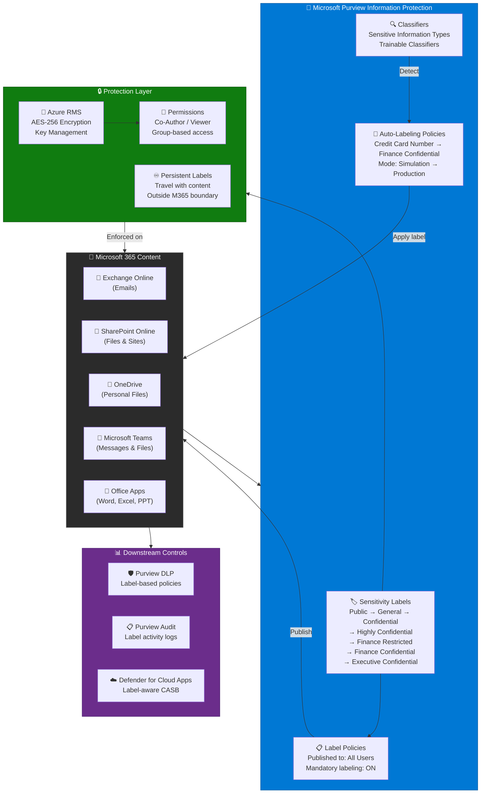
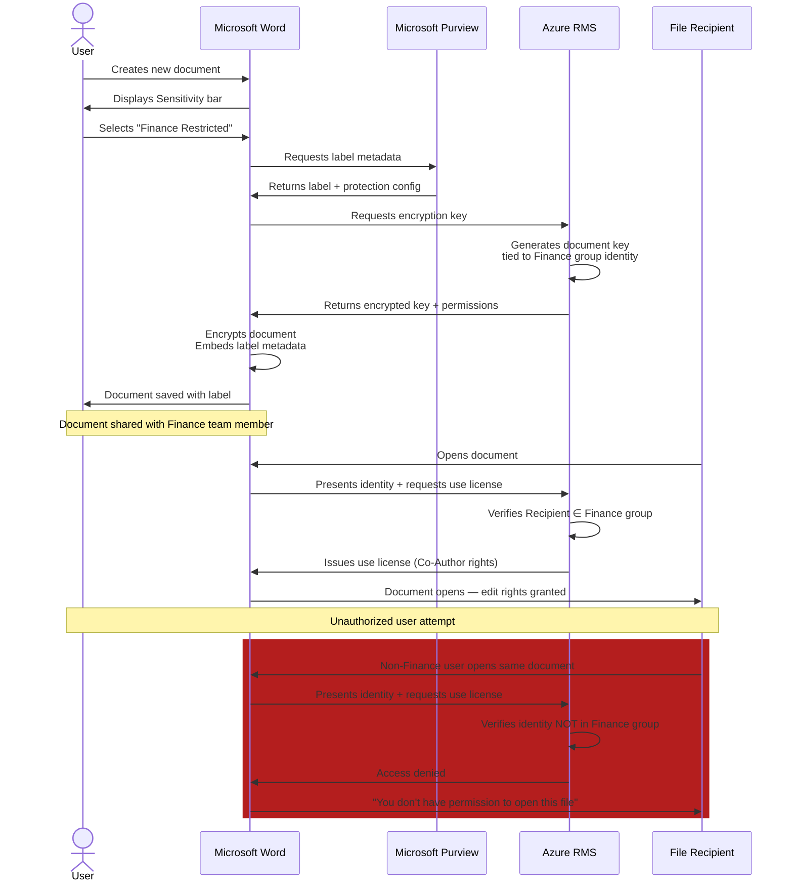
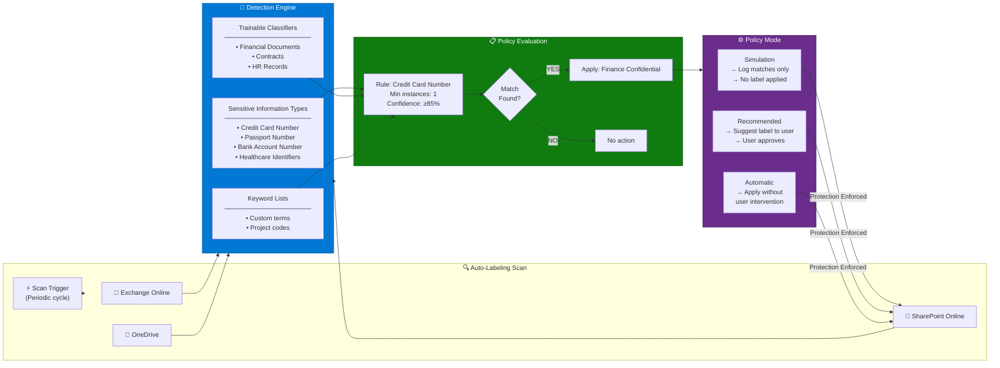
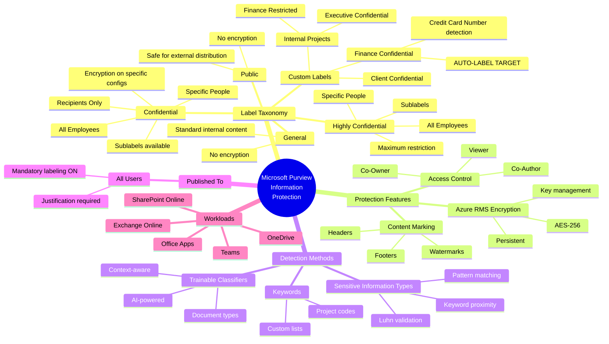
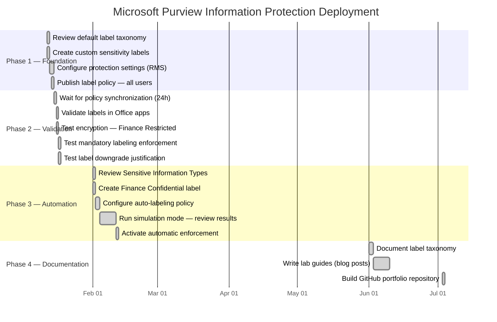

# Architecture Diagrams — Microsoft Purview Information Protection

## Diagram 1: High-Level Information Protection Architecture

---

## Diagram 2: Label Application Sequence — Manual Labeling

---

## Diagram 3: Auto-Labeling Detection Flow

---

## Diagram 4: Sensitivity Label Taxonomy Mindmap

---

## Diagram 5: Deployment Methodology (Gantt)

